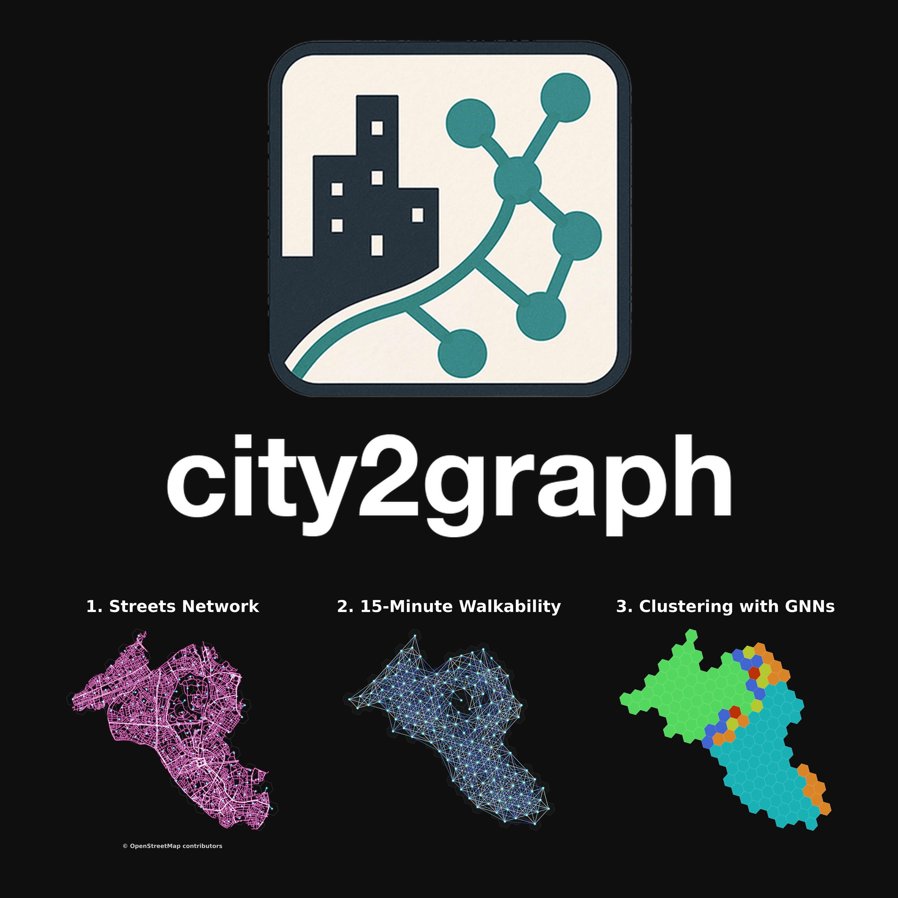

# GeoAI in Practice: From Geospatial Data to Graph Neural Networks with City2Graph

This workshop introduces Graph Neural Networks (GNNs) for geospatial practitioners. Using open-source Python tools including [PyTorch Geometric](https://pytorch-geometric.readthedocs.io/) and [City2Graph](https://city2graph.net/), participants will learn how to transform urban geospatial data into network structures and apply GNNs to model complex spatial relations.

**Part 1: Graph Data Engineering, Spatial Network Analysis, and GNNs** (Notebook WIP)

Learn to construct and analyse spatial networks using GeoPandas and NetworkX. We will demonstrate how to convert standard geospatial data (e.g., OpenStreetMap, GTFS, etc.) into unified graph structures with OSMnx and City2Graph. We will then explore key GNN architectures and transition from spatial graphs into tensor formats using PyTorch Geometric and City2Graph.

**Part 2: Build Your Own GeoAI Pipeline** [Jupyter Notebook](notebooks/part2_geoai.ipynb)

Put your skills into practice. Choose a city, extract its street network from OpenStreetMap or Overture Maps (optional), and train a Graph Autoencoder (GAE) for an unsupervised spatial clustering task. We will conclude by discussing how the GNN pipeline could be adopted for your business / research workflows.

## Who is this for?
* **Target Audience:** GIS analysts, spatial data scientists, and Python developers expanding their GeoAI and network modelling skills.

* **Prerequisites:** Basic proficiency in Python (especially GeoPandas) and GIS concepts. Basic knowledge of machine learning and neural networks (e.g., supervised vs. unsupervised learning, loss functions, activation functions, backpropagation). If you are not familiar with those topics of neural networks, I recommend watching 3Blue1Brown’s tutorial videos (Chapter 1-4) in advance ([English](https://www.youtube.com/playlist?list=PLZHQObOWTQDNU6R1_67000Dx_ZCJB-3pi) [Español](https://www.youtube.com/playlist?list=PLIb_io8a5NB0CP5ktJE9qaLd6GOfh1Z9m) [한국어](https://www.youtube.com/watch?v=wrguEHxk_EI&list=PLkoaXOTFHiqhM4MeCMrS016jOWKfIXTjK&index=6) [हिंदी](https://www.youtube.com/watch?v=uiZL9rK2Q_Q&list=PLxGL0qHs2IM0eZxOcYROIBd11XVKiyTeg) [日本語](https://www.youtube.com/watch?v=tc8RTtwvd5U) [русский](https://www.youtube.com/watch?v=RJCIYBAAiEI&list=PLZjXXN70PH5itkSPe6LTS-yPyl5soOovc) [中文](https://space.bilibili.com/88461692/lists/1528929?type=series)). No prior network science (NetworkX) or GNN (PyTorch Geometric) skills required.

## News
* **2026-03-08:** Repository updated for the upcoming workshop in **FOSS4G 2026 Hiroshima**.